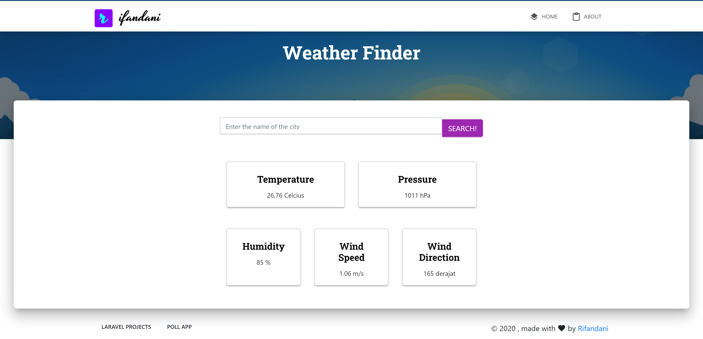

_My first functional Javascript project is to build a simple Weather Finder App based on NodeJS framework ExpressJS using Handlebars template engine, Axios for API calls, and weather API provider openweathermap.org. The app is deployed on [Heroku](https://agile-island-52063.herokuapp.com/)._

**Screenshot**

