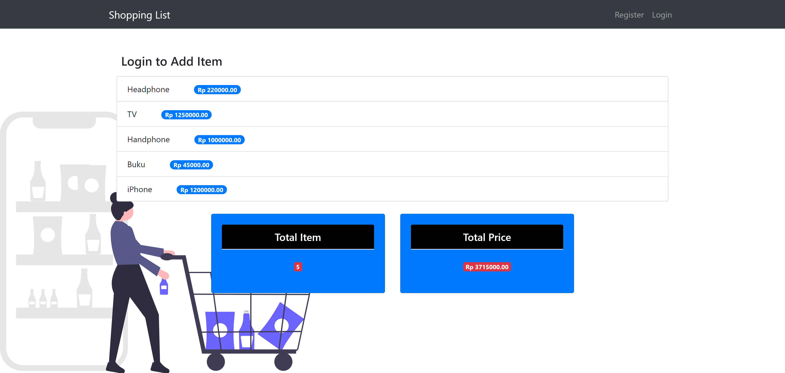
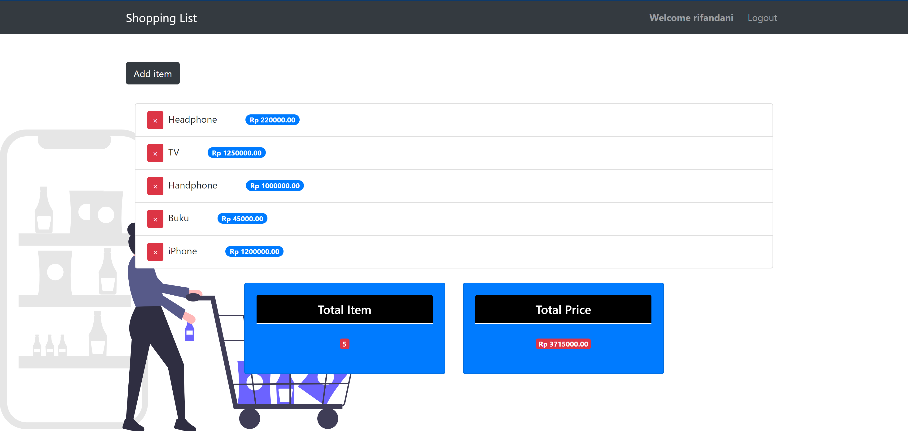

_A Register and Login Authentication Application built on top of ReactJS, Axios for fetching API, Reactstrap, and also Redux for the state management. The Backend uses ExpressJS, MongoDB database to store users credentials, password is crypted using Bcryptjs, and authentication system using JsonWebTokens. The app is deployed on [Heroku](https://rifandani-shopping-list.herokuapp.com/)._

**Home Page**

_Guest User can access the home page and see the items on the shopping list, but a registered users can add a new item and also delete an item on the list._

**Home Page For Authenticated User**

