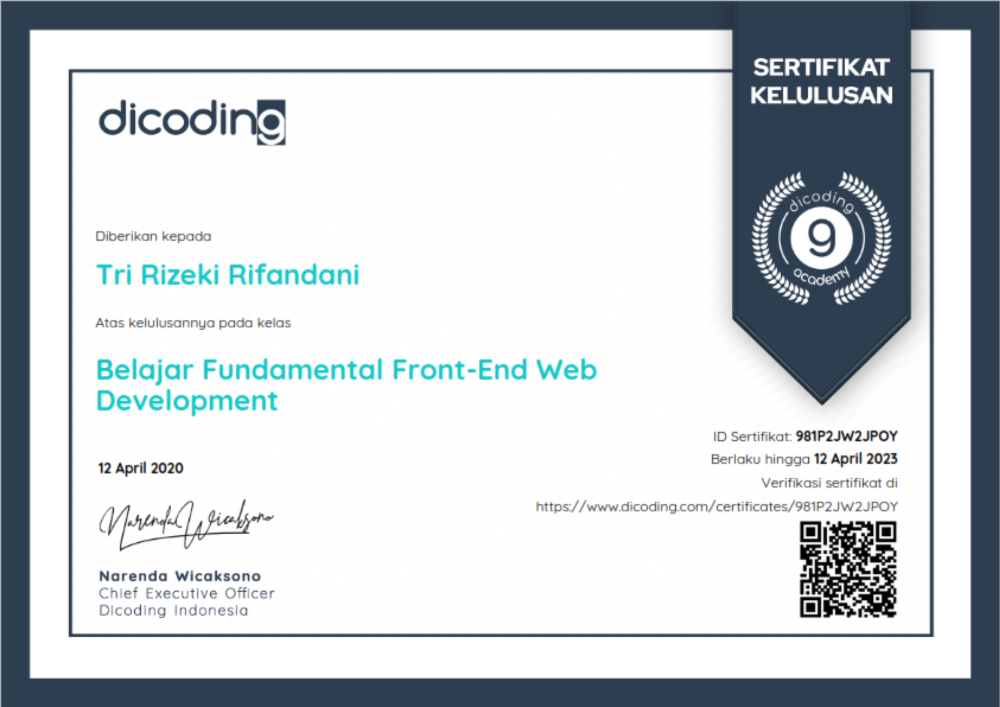
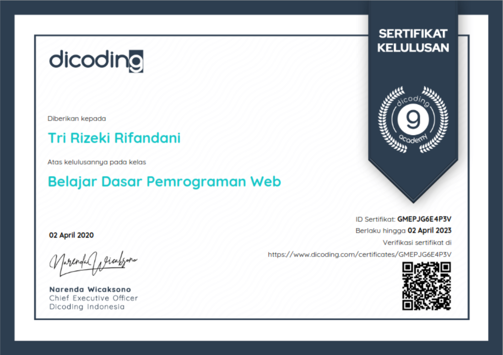

_Been busy this entire month finishing my third certification in Dicoding. This class discuss about all the basics you need to know to build a Progressive Web Applications or so PWAs, such as Promises and Fetch, Service Worker, Application Shell, Cache API, Indexed DB, Web Push and Workbox. Check the certificates validation by visiting the URL on the pictures. Check out my [LinkedIn](https://www.linkedin.com/in/rifandani/) profile to see all of my certificates._

**Membangun Progressive Web Apps Certificate**

_12 April 2020. I really excited learning the web development until i did not realize it that i could manage to complete the second certification in like 10 days. It is fun learning with Dicoding to be honest._

**Belajar Fundamental Front-End Web Development Certificate**

_It was 2 April 2020. My first ever experience in Front-End Developer Learning Path from Dicoding Academy. That time, i literally do not know anything about web development, but Dicoding could teach me the basics that i need to know, before i set my foot on this environment. This certificate makes me confident ._

**Belajar Dasar Pemrograman Web Certificate**

