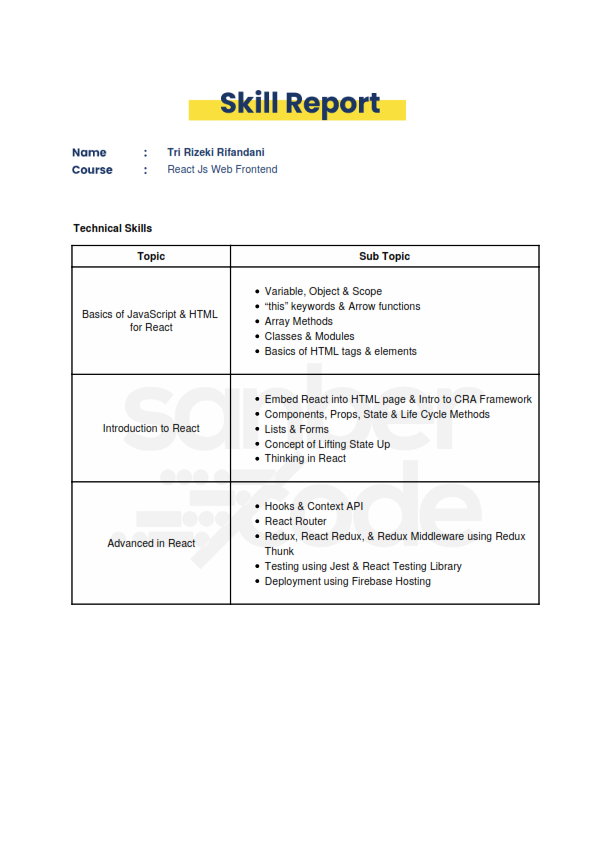

_A very interesting and valuable experience from Sanbercode bootcamp. I learnt a lot and it gave me a good grounding in the basics of React. It really made me think, and I also liked how it enabled me to interact with great people from the bootcamp. The assignments were corrected quickly, with lots of positive feedback from the tutors. I’m looking forward to follow up to the next advanced React course._

**React Js Web Frontend Certificate**

_All the skills report is described down below. Check out my [LinkedIn](https://www.linkedin.com/in/rifandani/) profile to see all of my certifications._

**React Js Skill Report Certificate**

