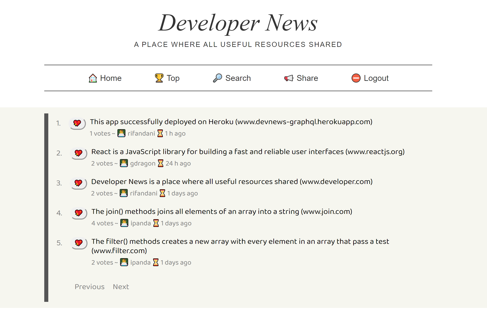
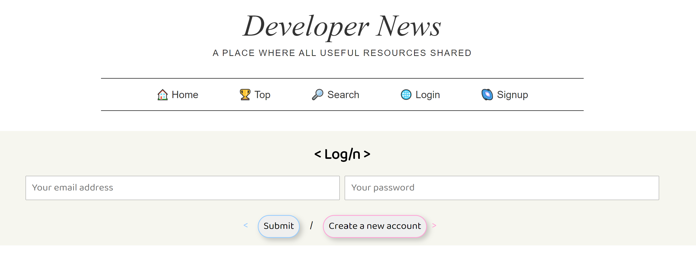
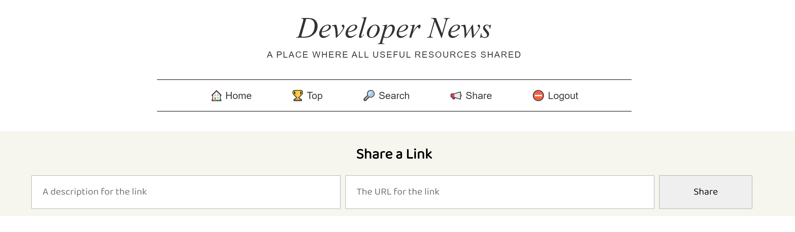
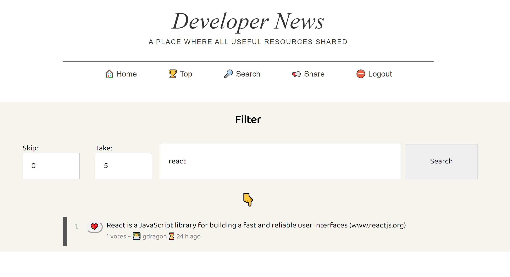

_GraphQL is Facebook’s new query language for fetching application data in a uniform way. GraphQL was designed to solve of the biggest drawbacks of REST-like APIs. Meanwhile, GraphQL is not a database query language like SQL, it’s an application layer query language that you can use with any backend. GraphQL is not opinionated about the network layer, which is often HTTP, nor about the payload format, which is usually JSON. It isn't opinionated about the application architecture at all. It is only a query language. And thats why i love GraphQL._

_This app implement GraphQL instead of REST with React as a FrontEnd and Graphql-yoga which is Express-based library as a BackEnd. Connected to the backend using Prisma2. Auth systems using usual bcryptjs and jwt. On the front, i use Apollo-Client to interact with the the GraphQL. This app has many features such as GraphQL Query, Mutations, Subscriptions(BackEnd), Filtering, Sorting, and Pagination. You can see the demo app on [Heroku](https://devnews-graphql.herokuapp.com/)._

**Home Page**

_In order to vote & share a link/post, user have to login/register first._

**Login Page**

**Share Page**

_To find a specific link/post, user can search it and filter it on /search endpoint._

**Filter Page**

