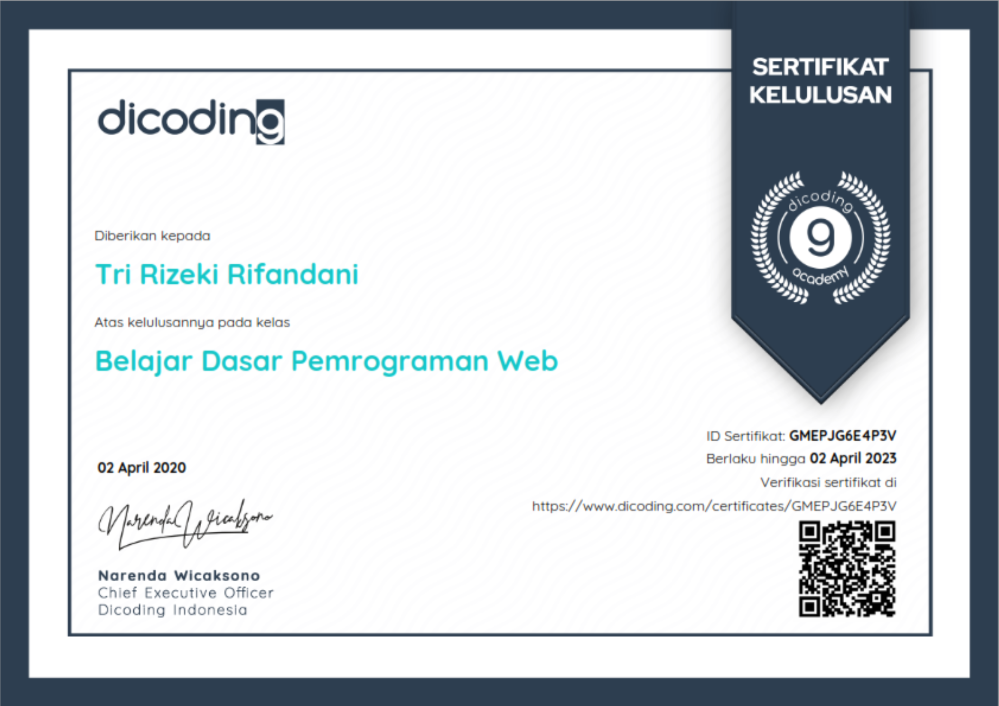

_Seorang Front-End Web Developer adalah Software Developer yang bertanggung jawab untuk merancang dan membangun berbagai aplikasi web secara responsif, interaktif, dan juga user friendly. Seorang Front-End Web Developer memiliki peranan besar dalam pengembangan aplikasi web karena bertanggung jawab langsung kepada pengalaman pengguna. Di sini saya diajarkan mulai dari dasar seperti pengenalan HTML, CSS kemudian menyusun layout yang responsif dengan Flexbox. Lalu, saya juga belajar cara membangun website dengan UI yang interaktif dan menghubungkan website dengan back-end server yang keduanya dilakukan menggunakan JavaScript. Hingga belajar bagaimana cara membuat website yang dapat diakses secara offline dengan menerapkan Service Worker._

_Kurikulum Front-End Web Developer di Dicoding telah dikembangkan dengan pelaku industri yang bergerak di bidang Web Development. Setiap langkah dalam learning path ini telah didesain agar siswa dapat memiliki pengetahuan yang cukup untuk menjadi seorang Front-End Web Developer yang dapat memenuhi kebutuhan industri._

**Belajar Dasar Pemrograman Web Certificate**

_Mempelajari komponen-komponen dasar HTML, CSS, dan Javascript yang merupakan fondasi utama untuk menjadi web developer._

_Total jam yang dibutuhkan untuk menyelesaikan kelas ini adalah 55 jam. Materi yang dipelajari, diantaranya:_

_Pengenalan HTML, Pendalaman HTML, Pengenalan CSS, Pendalaman CSS, Layout responsif menggunakan Flexbox, JavaScript Basic dan Manipulasi DOM, Web Storage, dan Proyek akhir responsif website sederhana._

**Belajar Fundamental Front-End Web Development Certificate**

_Mempelajari sintaks ES6, Web Component, dan Build Tools dalam membangun website dengan teknik yang simple, reusable, dan optimized._

_Total jam yang dibutuhkan untuk menyelesaikan kelas ini adalah 70 jam. Materi yang dipelajari, diantaranya:_

_ECMAScript 2015 (ES6), Web Component, Node Package Manager, Webpack, JavaScript Asynchronous Request, dan Proyek akhir website menerapkan Web Component, Webpack dan menampilkan data dari API._

**Membangun Progressive Web Apps Certificate**

_Beberapa waktu lalu, kelas ini mengalami perubahan dan akhirnya diputuskan untuk digabungkan menjadi satu menjadi kelas baru yaitu Menjadi Front-End Web Developer Expert._

**Menjadi Front-End Web Developer Expert Certificate**

_Mempelajari teknik-teknik expert serta modern dalam membangun website yang optimal pada seluruh perangkat, terutama pada perangkat mobile._

_Total jam yang dibutuhkan untuk menyelesaikan kelas ini adalah 90 jam. Materi yang dipelajari, diantaranya:_

_Mobile First Approach, Accessibility, JavaScript Clean Code, Progressive Web Apps, Automation Testing, Web Performance, dan Proyek akhir website menerapkan semua hal tersebut._

_Sourcecode untuk submission 1, 2, dan 3 dari kelas ini: [GitHub](https://github.com/rifandani/menjadi-web-developer-expert)._

**LinkedIn**

_Check the certificates validation by visiting the URL on the pictures or check out my [LinkedIn](https://www.linkedin.com/in/rifandani/) profile to see all of my certificates._
