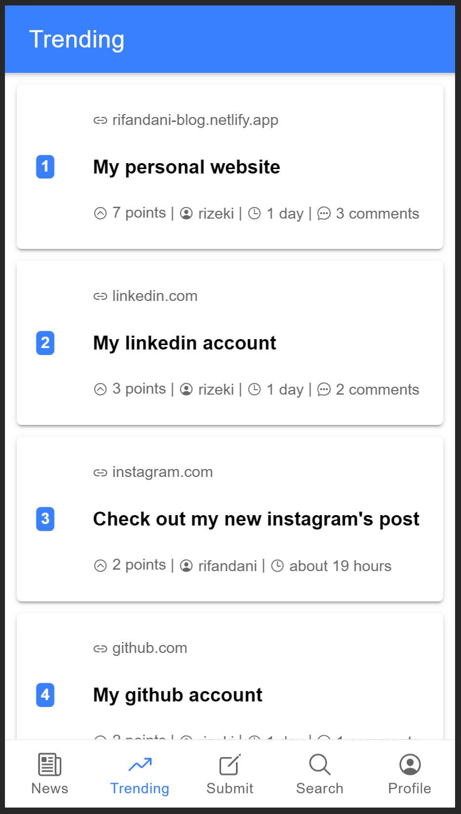
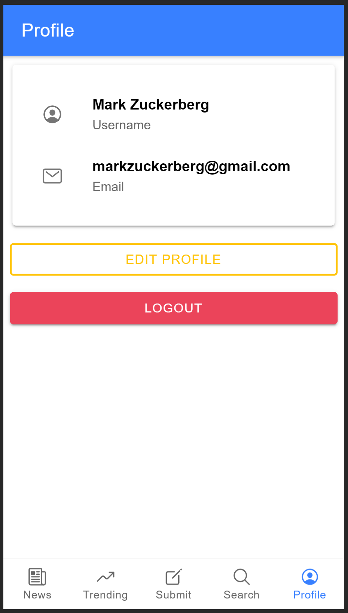
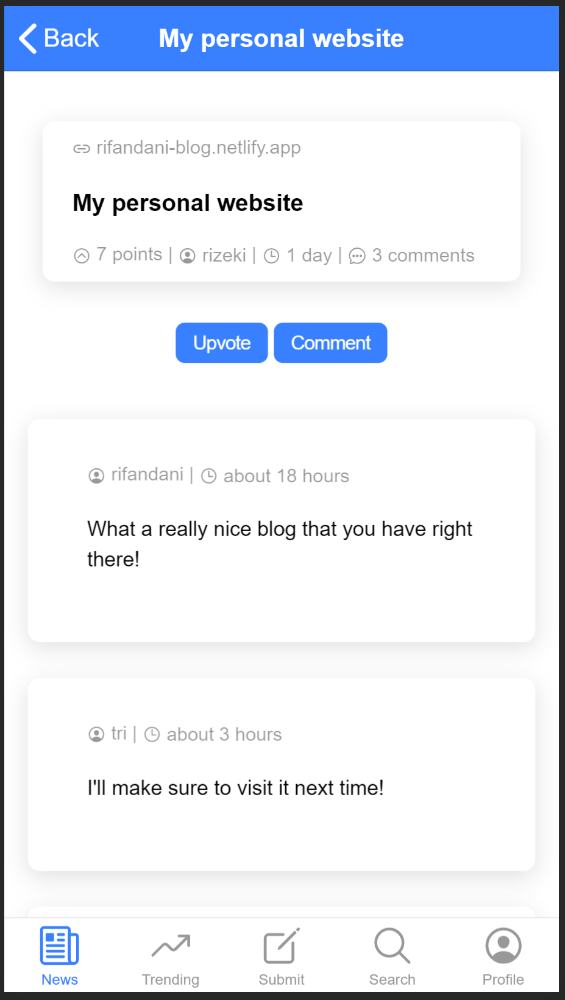
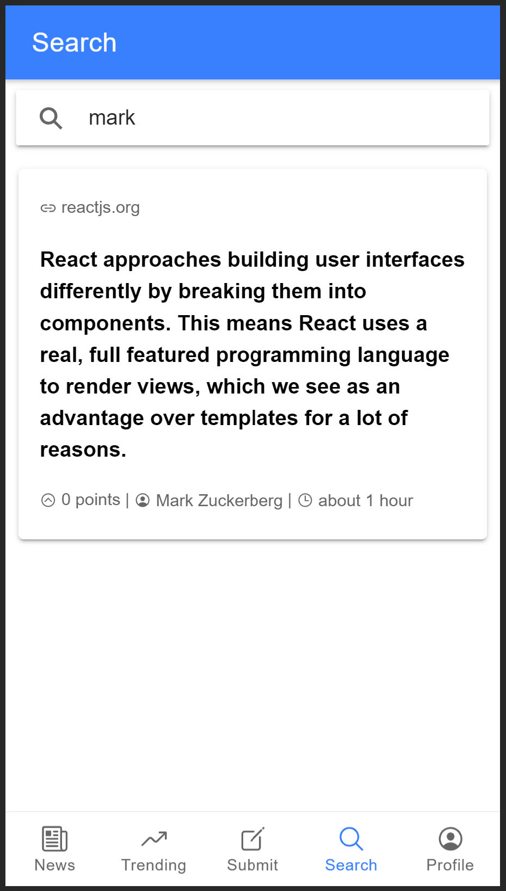

_Ionic Framework is an open source mobile UI toolkit for building high quality, cross-platform native and web app experiences. Ionic is built to perform and run fast on all of the latest mobile devices. Build out-of-the-box blazing fast apps with a small footprint and built-in best practices like hardware accelerated transitions, touch-optimized gestures, pre-rendering, and AOT compiling. Ionic is also engineered to integrate seamlessly with all best frontend frameworks, including Angular, React, Vue, or even no framework at all with vanilla JavaScript. You can visit their site on [Ionic](https://ionicframework.com/)._

_This app is built using Ionic Framework that let developers built hybrid app using just a single language which is Javascript. Connected to the firebase backend service, such as Auth systems, Firestore databases, and Firebase Hosting. On the front, i always use ReactJS to build an awesome UI. You can see the full demo app on [Firebase](https://react-firebase-crud-rifandani.web.app/)._

**Trending Page**

_In order to upvote, comment & submit a news, user have to be login/register first. Then, user can do all that and there's also a edit profile features in which user could change their username, email, and also their password._

**Profile Page**

_Every user can submit a news, delete their own news, upvote, comment, edit comment and delete comment on the news feed. The News Feed becomes more interactive this way._

**Link Page**

_To find a specific news, user can search it on the search tab._

**Search Page**

