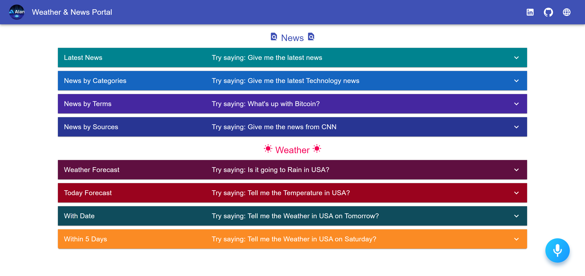
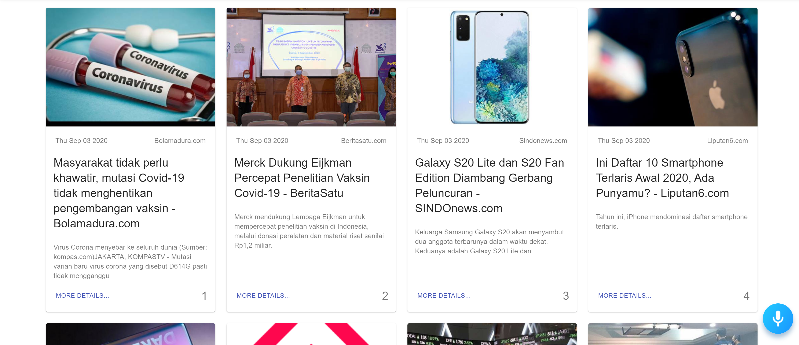
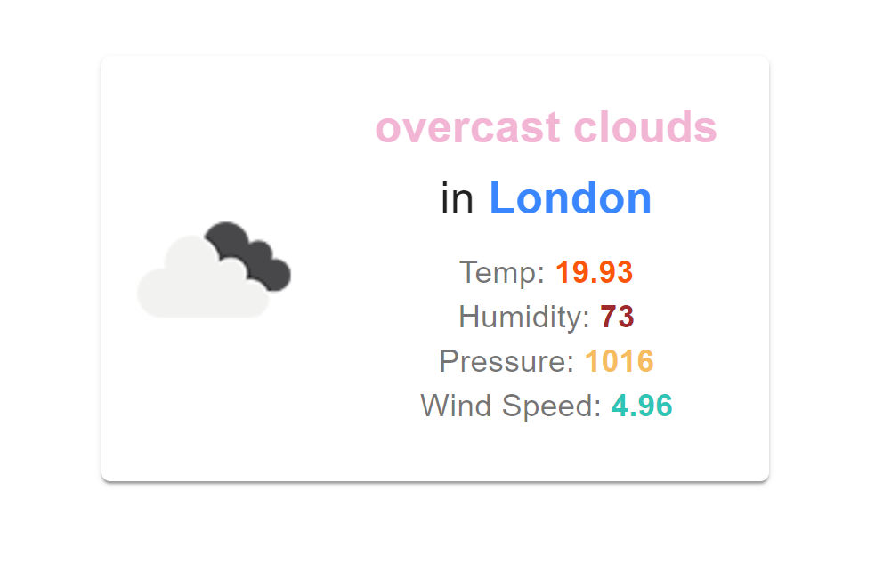

_This app is a Voice Controlled Weather and News Portal Application built with Alan AI. Alan AI is a revolutionary speech recognition software that allows you to add voice capabilities to an application. It allows you to control absolutely everything in the app using your voice._

_You can see the full demo app on [Netlify](https://rifandani-news.netlify.app/)._

**Home Page**

_You can use the app by clicking on the mic button on the bottom right. Based on the voice command, Alan AI will execute and display whether a news or weather reports._

**News Page**

_The latest news page._

**Weather Page**

_Weather forecast report page._
