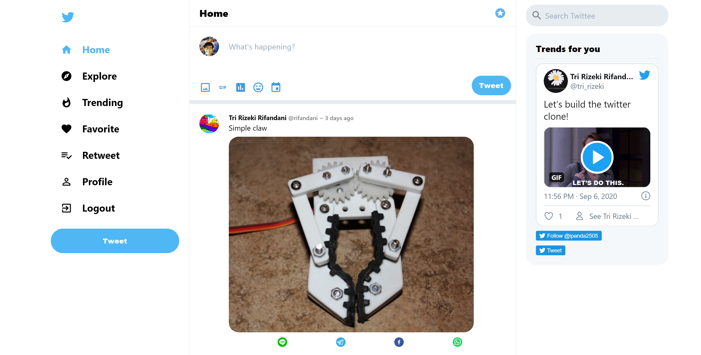
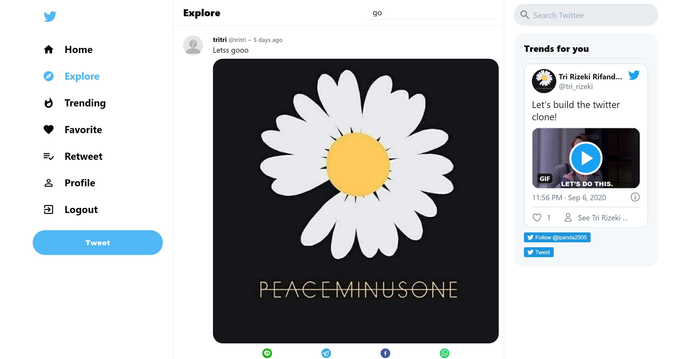
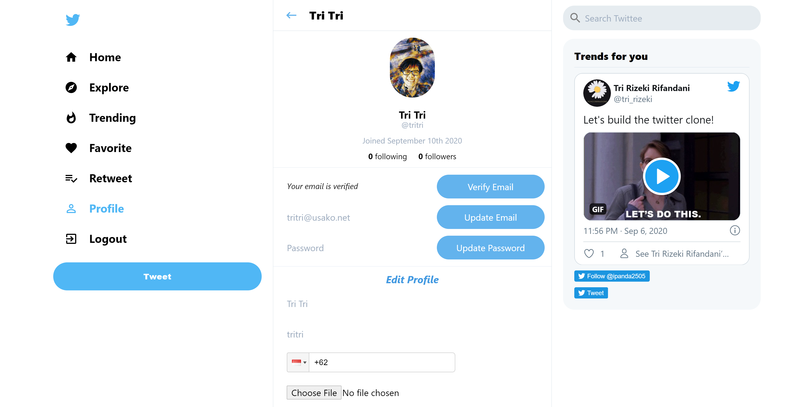
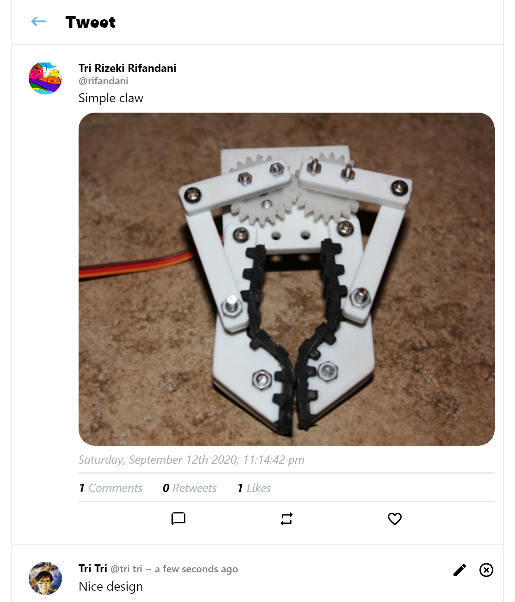
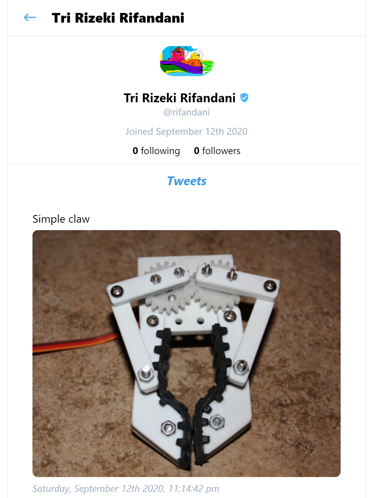

_This is a social media application built with React and Firebase. There is a lot of things going on in this app. I'm also using a ton of dependencies to make this app works smoothly, like Material-UI, Moment.js, React-Cookie, React-Flip-Move, React-Phone-Input-2, React-Share, React-Router-Dom, Validator, TailwindCSS, and also React-Twitter-Embed. I'm still not covering every single detailed thing that Twitter has. But at least, this app could works fine with a lot of functionality that works similar like the real twitter app._

_You can see the full demo app in [Here](https://rifandani-twitter-clone.web.app/)._

**Login Page**

_Every user needs to be registered to be able to access the application. This app provides an authentication systems powered by Firebase Auth. User can register / login and also send a reset password link if they forgot their passwords._

**Home Page**

_After user login, they will be redirected to the home page. Here, every user could see all the other users tweets/posts sorted by the latest post. Every user can upload a tweet/post with some text and a photo. Every post can be shared to various popular social media apps by clicking the social media icons below the posts image. Every single post can be clicked to go to that detailed post, in which user could like / retweet / comment and even delete their post. In the left section is a sidebar component, in which user could navigate through different routes. Trending is a posts, where everything is sorted based on the total amount of the likes. Explore is a page where a user could search for a specific post. Favorite is sorted based on every posts that user have liked before. Retweet is sorted based on every posts that user have retweeted before. Profile is a page where the user can edit their user profile. In the right section is a widget component. It displayed my recent real twitter post._

**Explore Page**

_For now in this route, user could search and filter for a specific posts/tweets text._

**Profile Page**

_In this route, user could see their user profile and their all tweets/posts. User could update their display name, username, phone number, photo profile, verified their email address, update their email address and also their password too._

**Post Page**

_This is a detailed post page. Here user could like, retweet, comment, edit comment, delete comment and also delete the post if it was their own post. User can click the avatar of the makers, to see the makers profile._

**User Page**

_This is a detailed user page. Every user could see other users profile and their tweets in this route._
