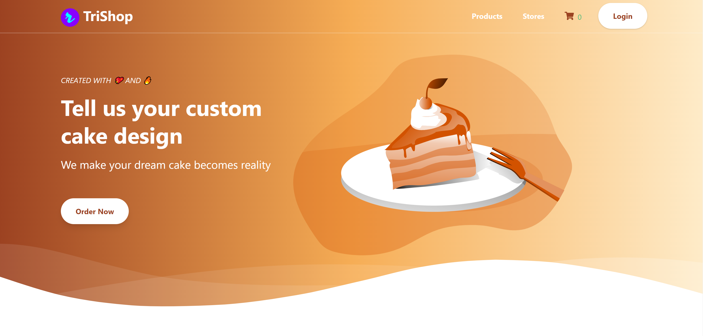
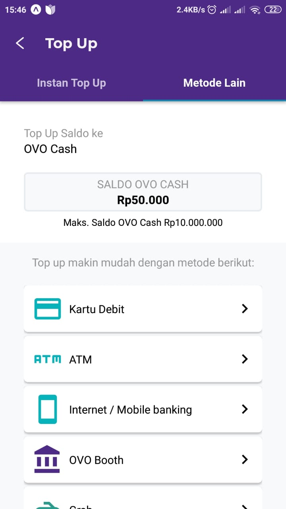

_I am so excited to start my first ever React Native Application using Expo. I decided to make a clone app which is based on the OVO app. I often use this app to pay my Grab Food and i think this app have a pretty good UI & functionality. So i chose this as my React Native app, although it is not exactly the same but at least it has a lot of similarity whether in UI or functionality. You can check the source code on my [Github](https://github.com/rifandani/ovo-clone)._

**Home Screen**

_Before user go to the home screen, they go to the intro splash screen first. On the home screen, user could go to the topup screen or they could spend their cash to pay any bills._

**TopUp Screen**

_This is where user topup their cash using Async Storage just to resembles some real money systems functionality._

**MetodeLain Screen**

_This is another tab view from topup screens but without any money systems functionality._

**Deals Screen**

_This screen displays a lot of UI thing using snap carousel, custom fonts, and a lot more._

**Finance Screen**

_This is a UI without any functionality just like from the real OVO app._

**Profile Screen**

_This is a UI screen where all the app / user configurations located but without any functionality._
