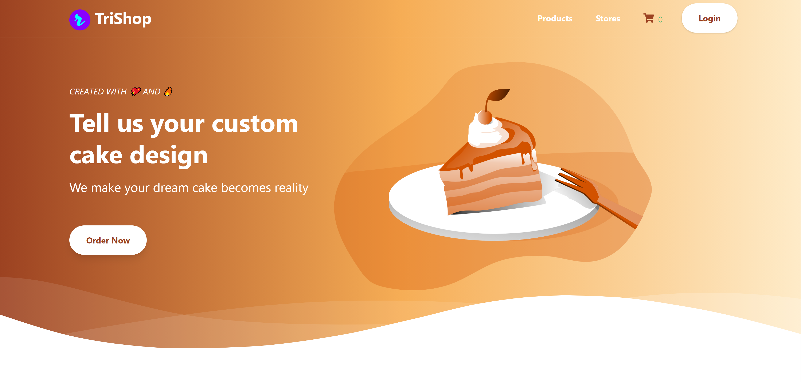
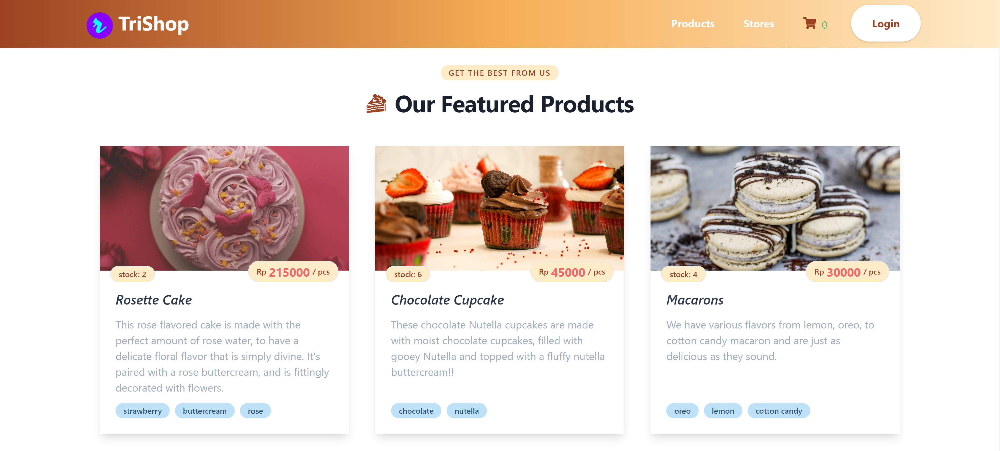
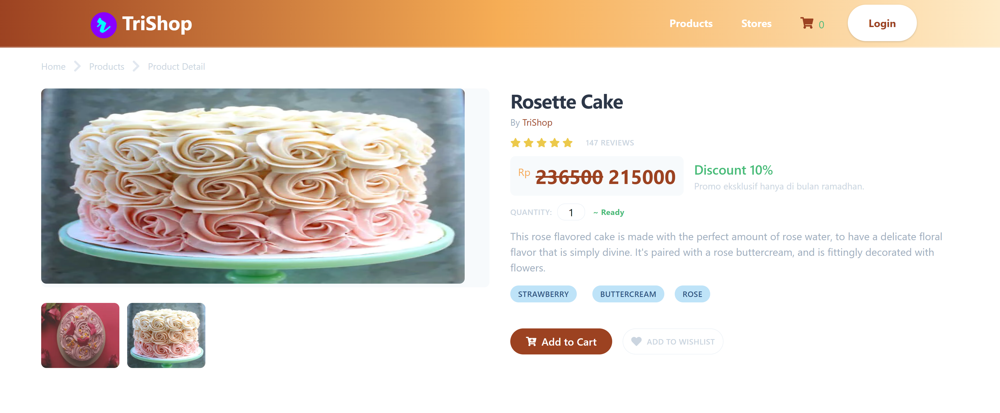
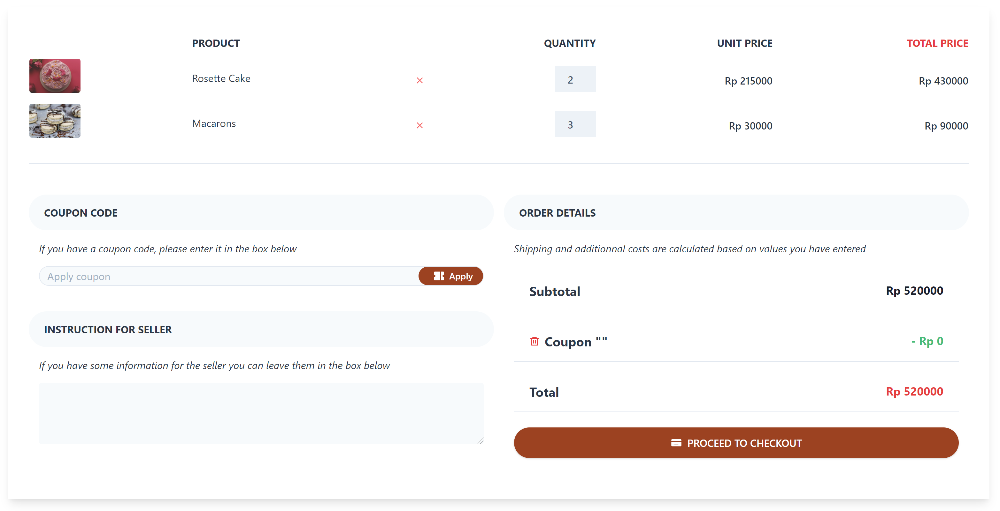
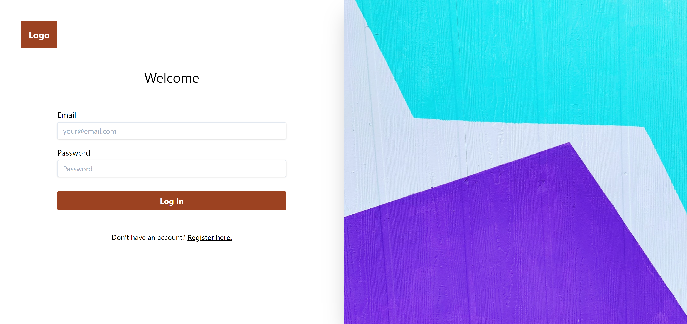
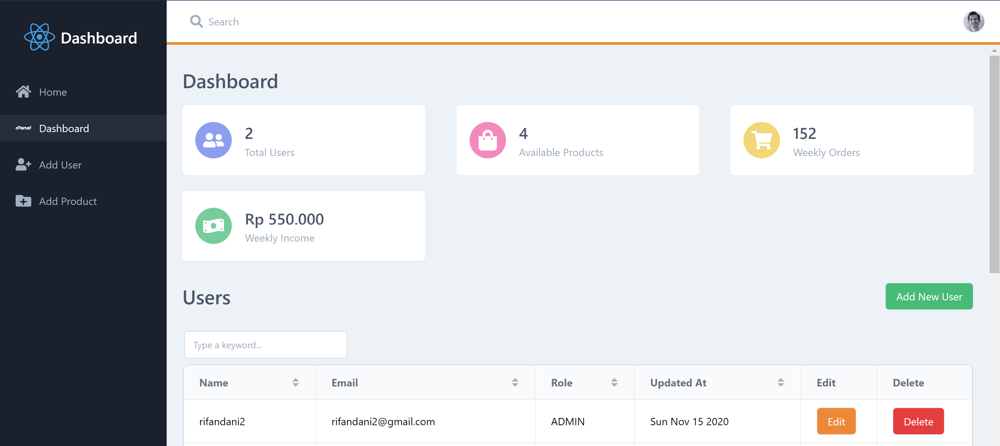

_.Fullstack e-commerce application built using Nextjs with MongoDB database and custom authentication middleware using JSON web tokens. This is a typical e-commerce website for a home business owner complete with user and admin dashboard to track payment and activity reports. You can check the application on [Vercel](https://trishop.vercel.app) and also the source code on my [Github Repo](https://github.com/rifandani/trishop)._

**Home Page**

_On the home screen, customer could see overview of the shop._

**Products Page**

_This is where all the shop owner products listed._

**Product Detail Page**

_When a customer clicks on the product card from the products page, they redirected to this page._

**Cart Page**

_When a customer decided to buy products from the shop, they would go this page before proceeding to the checkout page._

**Checkout Page**
_Coming soon._

**Login Page**

_This is where the customer or shop owner login. If the customer login, they will be redirected to the customer dashboard, else they will be redirected to the admin dashboard._

**Customer Dashboard Page**
_Coming soon._

**Admin Dashboard Page**

_This is where shop owners could see all the overall info and statistics from the website. Admin could create, edit, delete the users / admins and also create, edit, delete the products listing._
