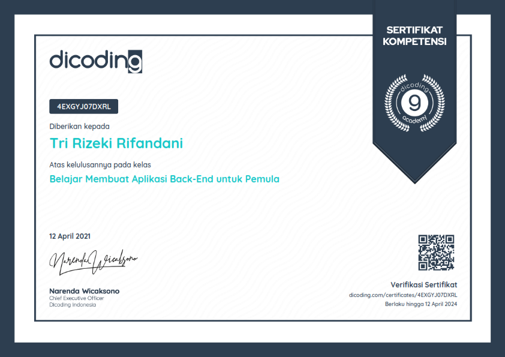
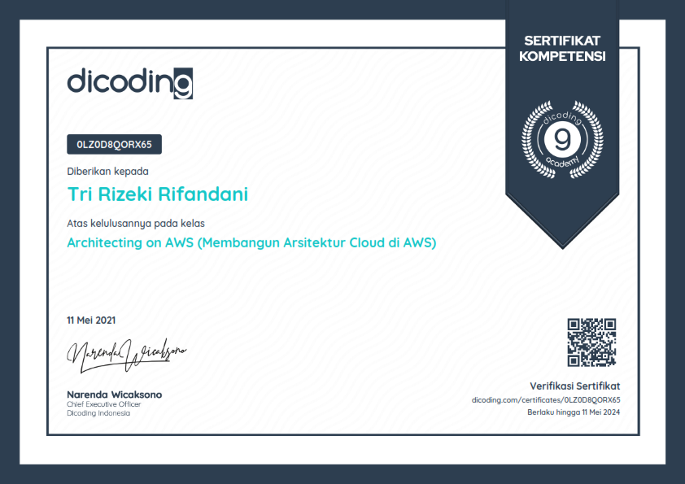

_Seorang Back-End Developer adalah Software Developer yang bertanggung jawab dalam mengelola server, aplikasi, dan database agar dapat saling berkomunikasi dengan baik dan lancar. Seorang Back-End Developer memiliki peranan yang sangat penting karena dengan Back-End lah suatu aplikasi Front-End dapat berjalan dengan semestinya. Pada learning path ini, Anda akan belajar mulai dasar pembuatan RESTful API; menggunakan teknologi database, storage, message broker, authentication dan authorization; hingga mempelajari konsep expert dalam mengembangkan RESTful API seperti Clean Architecture, Serverless, Container, dan CI/CD._

_Kurikulum Back-End Developer di Dicoding telah dikembangkan bersama AWS dan pelaku industri yang bergerak di bidang Back-End Development. Setiap langkah dalam learning path ini telah didesain agar siswa dapat memiliki pengetahuan yang cukup untuk menjadi seorang Back-End Developer._

**Cloud Practitioner Essentials (Belajar Dasar AWS Cloud) Certificate**

_Mempelajari materi dasar Cloud dengan menggunakan AWS, dari konsep cloud computing, hingga cara membangun arsitektur yang baik._

_Total jam yang dibutuhkan untuk menyelesaikan kelas ini adalah 13 jam. Materi yang dipelajari, diantaranya:_

_Pengantar ke Amazon Web Services, Komputasi di Cloud, Infrastruktur Global dan Keandalan, Jaringan, Penyimpanan dan Database, Keamanan, Pemantauan dan Analitik, Harga dan Dukungan, Migrasi dan Inovasi, Perjalanan Cloud, serta Dasar-Dasar AWS Certified Cloud Practitioner._

**Belajar Dasar Pemrograman JavaScript Certificate**

_Mempelajari dasar JavaScript, dari fundamental, sintaks dan fitur ES6, hingga konsep automation test menggunakan framework populer._

_Total jam yang dibutuhkan untuk menyelesaikan kelas ini adalah 45 jam. Materi yang dipelajari, diantaranya:_

_Pengenalan Javascript, JavaScript Fundamentals, Data Structure, Function, Object-Oriented Programming, Functional Programming, Setup Environment, Module, Error Handling, Concurrency, Node Package Manager, serta JavaScript Testing._

**Belajar Membuat Aplikasi Back-End untuk Pemula Certificate**

_Mempelajari dasar dalam membangun RESTful API, dari HTTP server, routing, hingga membangun Back-End untuk aplikasi yang nyata._

_Total jam yang dibutuhkan untuk menyelesaikan kelas ini adalah 45 jam. Materi yang dipelajari, diantaranya:_

_Pengenalan ke Back-End, Dasar-Dasar Node.js, Membangun Web Service menggunakan Node.js, Deploy Web Service, serta Mengonsumsi dan Menguji RESTful API menggunakan Postman._

_Sourcecode untuk submission di kelas ini: [GitHub](https://github.com/rifandani/belajar-membuat-aplikasi-backend)._

**Architecting on AWS (Membangun Arsitektur Cloud di AWS) Certificate**

_Mempelajari cara membangun arsitektur cloud di AWS, dari yang sederhana dengan Amazon S3, hingga yang canggih dengan serverless.._

_Total jam yang dibutuhkan untuk menyelesaikan kelas ini adalah 40 jam. Materi yang dipelajari, diantaranya:_

_Arsitektur Tersederhana dari AWS, Menambahkan Lapisan Komputasi, Menambahkan Lapisan Database, Jaringan di AWS - Bagian 1, Jaringan di AWS - Bagian 2, AWS Identity and Access Management (IAM), Elastisitas, Ketersediaan Tinggi, dan Pemantauan, Automasi, Caching, Membangun Decoupled Architecture, Arsitektur Microservices dan Serverless, RTO/RPO dan Backup Recovery Setup, serta Pengoptimalan dan Ringkasan._

**LinkedIn**
_Check the certificates validation by visiting the URL on the pictures or check out my [LinkedIn](https://www.linkedin.com/in/rifandani/) profile to see all of my certificates._
