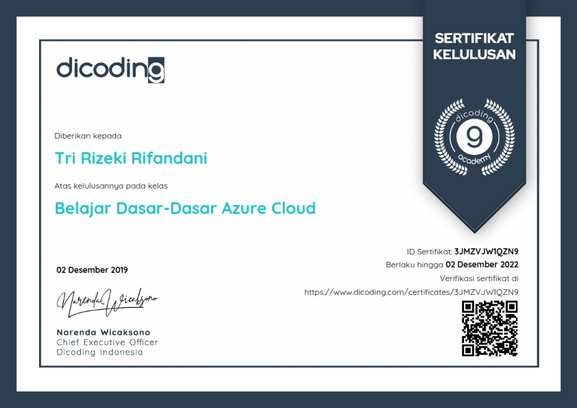
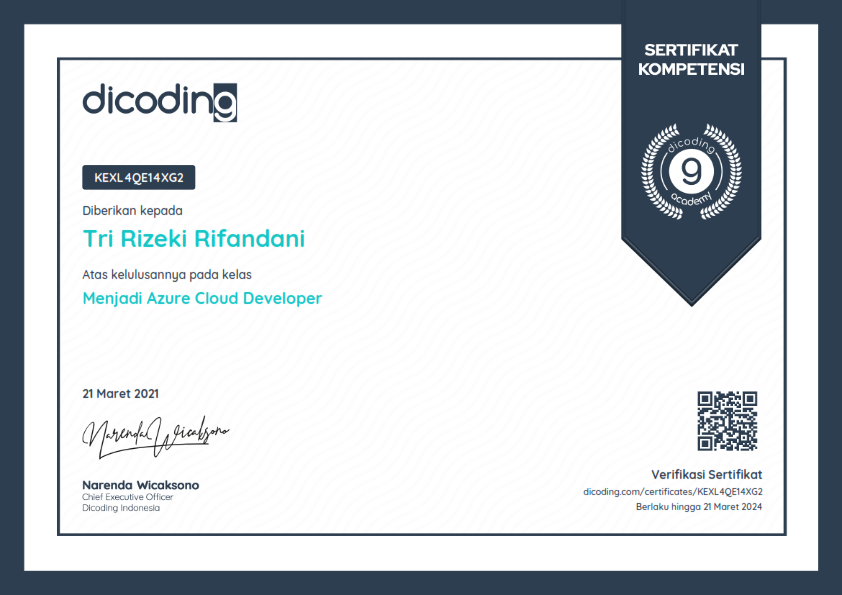

_Komputasi awan menjadi tren baru di dunia teknologi yang banyak dibicarakan. Diperkirakan pada tahun 2025, 80% organisasi akan memindahkan beban kerjanya ke cloud. Azure memiliki lebih dari 100 layanan untuk membangun dan mengelola aplikasi. Microsoft Azure memiliki 54 region data center yang tersebar di seluruh dunia, lebih banyak dari cloud provider manapun. Beberapa perusahaan terkenal yang menggunakan Microsoft Azure antara lain Spotify, Unilever, SAP, dsb._

**Belajar Dasar-Dasar Azure Cloud Certificate**

_Materi di kelas ini disusun oleh Dicoding dan telah divalidasi oleh Microsoft sebagai pemilik teknologi untuk mengenalkan prinsip-prinsip komputasi awan serta pengenalan layanan-layanan Azure cloud seperti layanan komputasi, penyimpanan, dan monitoring dalam pembuatan beserta pengelolaan aplikasi berbasis cloud._

_Total jam yang dibutuhkan untuk menyelesaikan kelas ini kira-kira sekitar 40 jam. Materi yang dipelajari, diantaranya:_

_Prinsip-Prinsip Komputasi Awan : Mempelajari konsep dan terminologi dari teknologi komputasi awan, seperti jenis dan perbandingannya dengan infrastruktur fisik (on-premise).._
_Pengenalan Azure : Memperkenalkan dengan Microsoft Azure dan layanan apa saja yang tersedia di dalamnya._
_Arsitektur dan Layanan Azure : Mempelejari tentang infrastruktur yang menjalankan teknologi cloud dari Azure dan bagaimana Azure dapat membantu meningkatkan kinerja aplikasi Anda._
_Akun Azure : Mempelajari perbedaan akun dan langganan Azure, mengelola akun Azure, dan dukungan apa saja yang Anda dapat dari mendaftar akun Azure._
_Pengenalan Azure Portal : Mempelajari bagaimana menggunakan Azure Portal sebagai antarmuka utama dalam menggunakan Azure._
_Layanan Komputasi Azure : Mempelajari jenis-jenis layanan komputasi yang ada di Azure seperti Virtual Machines (VM), Containers, dan Serverless._
_Layanan Data Azure : Mempelajari beberapa jenis layanan penyimpanan untuk menyimpan dan mengelola data Anda di cloud._
_Layanan Jaringan Azure : Mempelajari bagaimana layanan Azure saling berkomunikasi dan bagaimana membuat aplikasi Anda selalu tersedia bagi pengguna._
_Keamanan di Azure : Mempelajari bagaimana Anda dan Azure bertanggung jawab untuk melindungi data dan aplikasi Anda dari serangan._
_Monitoring Infrastruktur Azure : Mempelajari bagaimana Anda memantau kondisi aplikasi Anda sehingga bisa tetap tersedia bagi pengguna._
_Mengelola Sumber Daya Azure : Mempelajari tentang layanan-layanan yang akan membantu Anda mengelola sumber daya Azure secara efisien._
_Estimasi Biaya pada Azure : Mempelajari tentang faktor yang mempengaruhi biaya, bagaimana menghitung estimasi biaya, dan cara-cara untuk menghemat pengeluaran di Azure._
_Exam : Merupakan ujian pilihan ganda untuk menguji pemahaman Anda terhadap materi di kelas ini sekaligus latihan soal untuk AZ-900._

**Menjadi Azure Cloud Developer Certificate**

_Kelas lanjutan untuk mempelajari konsep dan terminologi cloud beserta berbagai layanan Azured Cloud sesuai kebutuhan sertifikasi Azure Developer Associate. Materi di kelas ini disusun oleh Dicoding dan telah divalidasi oleh Microsoft sebagai pemilik teknologi Azure Cloud. Kelas ini disusun untuk Anda yang ingin mendalami layanan-layanan Azure cloud seperti layanan komputasi, penyimpanan, dan kognitif untuk membuat dan mengembangkan aplikasi berbasis cloud._

_Total jam yang dibutuhkan untuk menyelesaikan kelas ini adalah 70 jam. Materi yang dipelajari, diantaranya:_

_Pengenalan Azure : Mempelajari konsep komputasi awan dan Microsoft Azure (1 jam)._
_Azure IaaS Compute Solutions : Mempelajari teori dan praktik layanan Infrastructure as a service dari Microsoft Azure untuk tugas komputasi (6 jam)._
_Azure PaaS Compute Solutions : Mempelajari teori dan praktik tentang Azure App Service, layanan Platform-as-a-Service dari Microsoft Azure (7 jam)._
_Azure Database : Mempelajari teori dan praktik tentang layanan basis data yang bisa digunakan pada Microsoft Azure (10 jam)._
_Azure Storage : Mempelajari teori dan praktik tentang jenis-jenis penyimpanan yang bisa digunakan pada Microsoft Azure (13 jam)._
_Azure Security : Mempelajari teori dan praktik terkait keamanan dalam pengembangan aplikasi (1 jam)._
_Monitor, Troubleshoot, and Optimize Solutions : Mempelajari teori dan praktik tentang bagaimana memantau dan mengoptimasi solusi aplikasi dengan Azure (5 jam)._
_Azure and Third-party Services : Mempelajari teori dan praktik integrasi layanan Azure dengan layanan pihak ketiga (6 jam)._
_Azure Cognitive : Mempelajari teori dan praktik tentang layanan-layanan kognitif pada Microsoft Azure yang bisa digunakan developer dalam mengembangkan aplikasinya (4 jam)._
_Best Practices : Mempelajari teori tentang bagaimana membangun arsitektur aplikasi pada Microsoft Azure yang sesuai dengan best practice (1 jam)._
_Submission : Kelas ini memiliki tugas di mana Anda akan mengembangkan dan men-deploy solusi cloud dari Microsoft Azure (16 jam)._

_Sourcecode untuk submission 1 dan 2 di kelas ini: [GitHub](https://github.com/rifandani/dicoding-azure-submission-full)._
_Roadmap submission 1 dan 2 di kelas ini: [GitHub](https://github.com/rifandani/dicoding-azure-submission-full/projects/2)._
_Aplikasi submission: [Azure Static Web](https://thankful-wave-086fca500.azurestaticapps.net/)._

_Check the certificates validation by visiting the URL on the pictures or check out my [LinkedIn](https://www.linkedin.com/in/rifandani/) profile to see all of my certificates._
