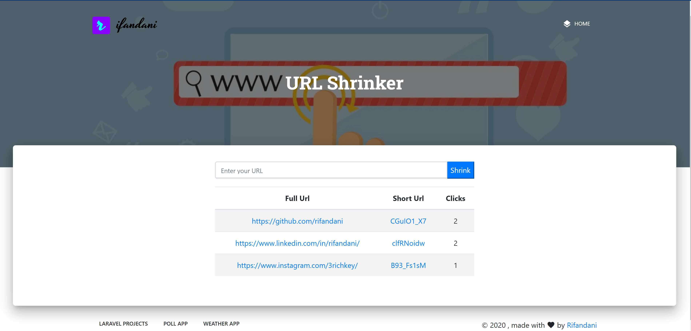

_Another simple URL Shrinker App based on NodeJS framework ExpressJS using EJS template engine, Axios for API calls, and MongoDB as a NoSQL database. The app is deployed on [Heroku](https://url-shrinker-app.herokuapp.com/)._

**Screenshot**

