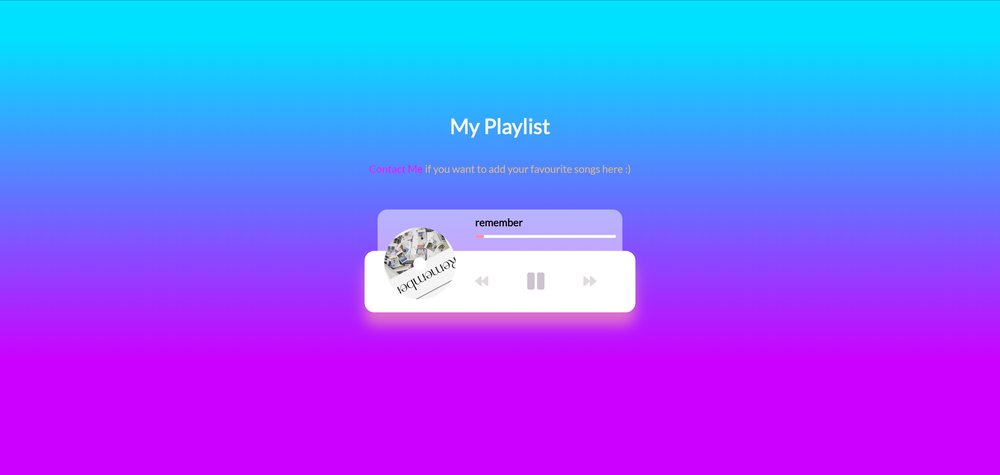

_Nothing fancy, just a simple functional Music Player App based on NodeJS framework ExpressJS using hbs template engine. The app is deployed on [Heroku](https://rifandani-playlist.herokuapp.com/)._

**Screenshot**

