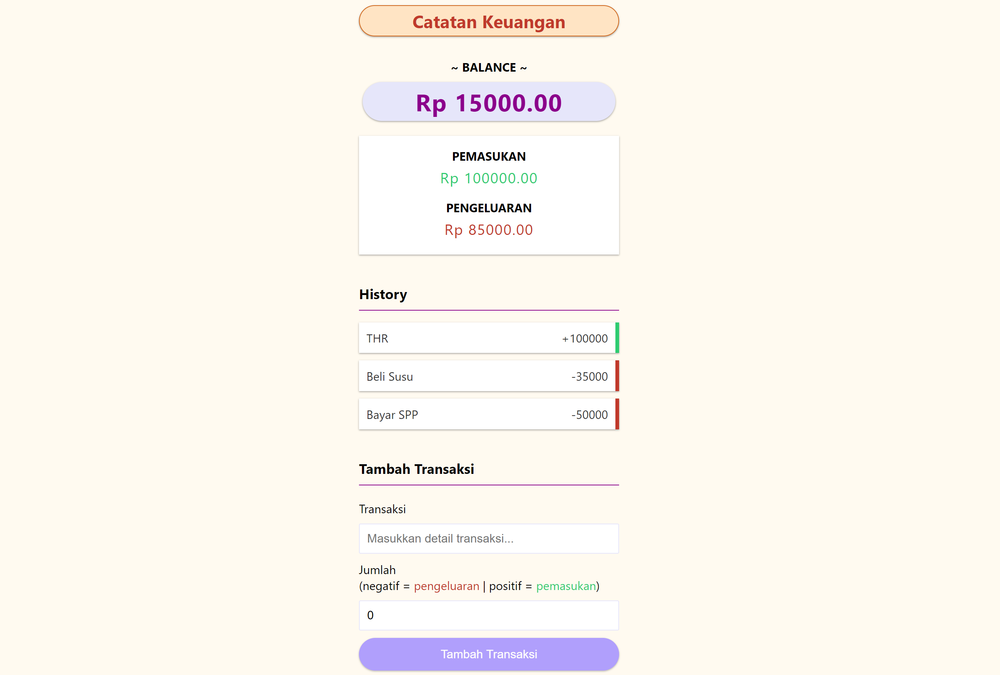

_My first FullStack Application built on top of MERN Stack. This Application also PWA supported. Catatan Keuangan is used for tracking your personal incomes and expenses. The app is deployed on [Heroku](https://rifandani-catatan-keuangan.herokuapp.com/)._

**Screenshot**

