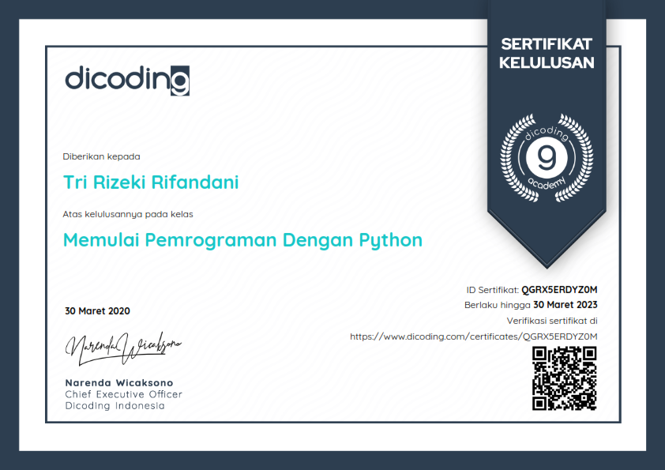
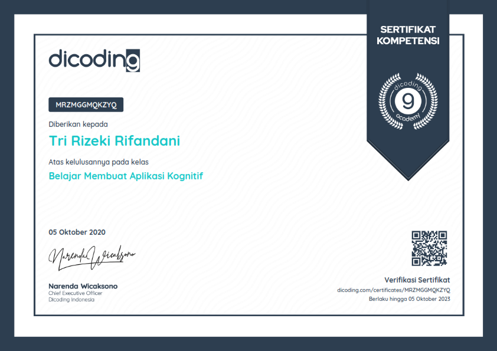

_Machine Learning is rising like rockets inside big industries and companies. The need for a tool that can help developer iterate through the process quickly has become vital. That's where Python comes in, a star in Machine Learning technology, one of the easiest programming languages to learn, is often the first choice to bring developer to success. Dicoding, one of the pioneer in programming academy, offered a free Machine Learning in their new scholarship program in which collaborates with IBM to prepare and develop more competent programmer in Indonesia. So. can't say no to that and i immediately took it. A perfect start for a Machine Learning journey._

**Memulai Pemrograman dengan Python Certificate**

_Getting started with Python is the first thing to do. Understand the sytax is pretty easy because it's doesn't have much different with Javascript._

**Belajar Membuat Aplikasi Kognitif Certificate**

_Here i learn to use IBM Watson AI technologies. Start with IBM Cloud, Speech-to-Text, Text-to-Speech, Tone Analyzer, Watson Assistant which is like a chatbot, Image Recognition, Natural Language Understanding like a translator, and also Watson Discovery which is a Machine Learning services._

**Belajar Dasar Machine Learning Certificate**

_Here i learned to create my own simple Machine Learning model to predict an image and test it using Google Collab which is based on Jupyter. A perfect collection of subjects and resources for a newcomer in Machine Learning like me._

_Check the certificates validation by visiting the URL on the pictures or check out my [LinkedIn](https://www.linkedin.com/in/rifandani/) profile to see all of my certificates._
