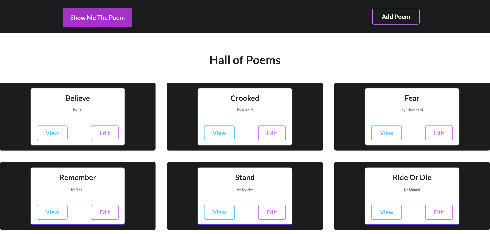
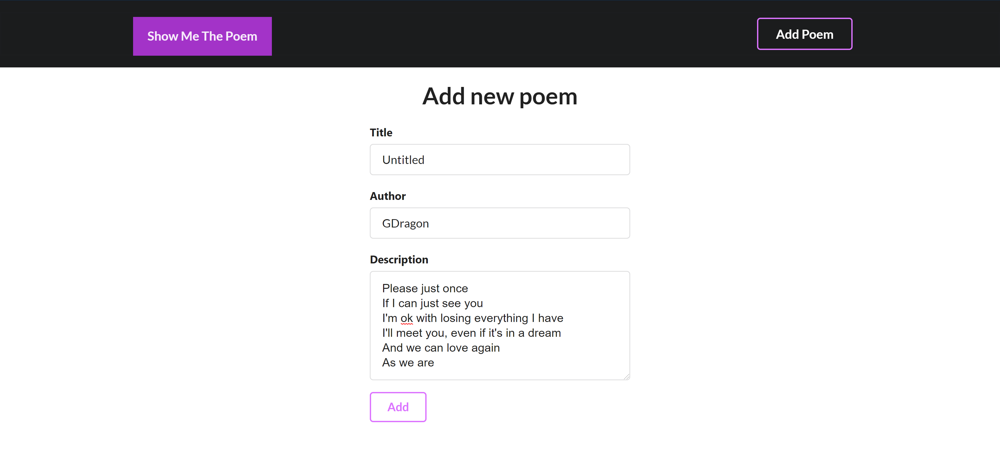

_My first Next.js Application built on top of MERN Stack and using Semantic-UI-React for the mobile responsive UI. This Application also PWA supported which means that every devices could install it and the application will behaves like a native app. Show Me The Poem is used to create and share everyone thoughts and feelings through a words. The app is deployed on [Vercel](https://show-me-the-poem.now.sh/)._

**Screenshot**

