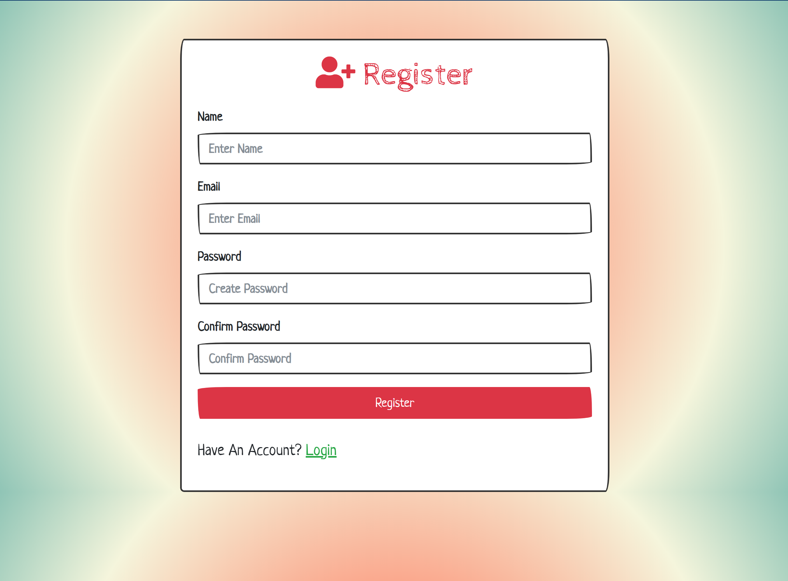

_My first Register and Login Authentication Application built using ExpressJS, MongoDB database to store users credentials, password is crypted using Bcryptjs, authentication system using PassportJS, and the template engine EJS. This project could be used as a boilerplate for a larger application that going to use an authentication to authenticate their users before actually accessing some private routes from the application. The app is deployed on [Heroku](https://rifandani-node-auth.herokuapp.com/)._

**Screenshot**

